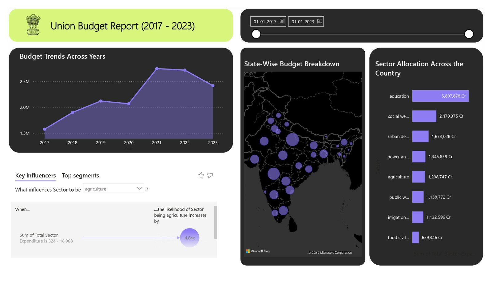

# India Union Budget Dashboard (2017 - 2023): Sector and State Analysis 

## Overview

This project involves the development of a Power BI dashboard that visualizes and analyzes India's Union Budget from 2017 to 2023. The dashboard focuses on key sectors and states, providing a comprehensive view of budget allocations and trends over the years. It is designed to support dynamic insights and historical analysis with interactive features.

## Objectives

- **Sector-Specific Analysis**: Examine budget allocations and trends across various sectors, highlighting changes and developments over the years.
- **State-Wise Comparison**: Analyze and compare budget allocations and expenditures across different states to understand regional priorities and variations.
- **Interactive Features**: Implement interactive elements in Power BI for users to explore data dynamically and gain deeper insights.
- **Actionable Insights**: Provide insights and recommendations for budgetary and policy decisions based on the analysis of the data.

## Features

- **Interactive Visualizations**: Dynamic charts and graphs for sector and state-wise budget analysis.
- **Trend Analysis**: Historical budget data from 2017 to 2023 to observe trends and changes.
- **Sector Insights**: Detailed view of budget allocations for key sectors such as health, education, infrastructure, and defense.
- **State Comparisons**: Comparative analysis of budget allocations and spending across various Indian states.
- **Actionable Insights**: Summary of findings with recommendations for policy-making and budget planning.

## Getting Started

1. **Setup**: Open the Power BI file containing the dashboard.
2. **Navigation**: Use the interactive elements to explore different sectors and states.
3. **Analysis**: Apply filters to view specific data and analyze trends.
4. **Insights**: Review the actionable insights provided in the dashboard for budgetary and policy decision-making.
